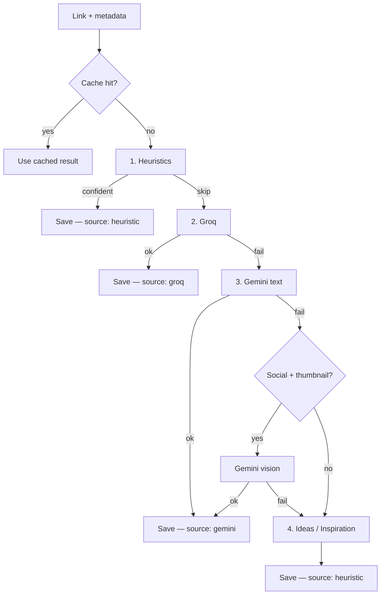

# Link classification

How Bookmark decides **board**, **title**, and **description** when you share a link.

Implementation: `supabase/functions/save-bookmark/index.ts`

---

## End-to-end flow

```
Share URL from phone
    → save-bookmark edge function
        → normalize URL
        → fetch metadata (oEmbed, Microlink, OG tags, YouTube player)
        → lookup classification cache (60-day TTL)
        → if miss: run classification pipeline
        → create board if needed
        → insert bookmark
```

Each user has **private** boards. The classifier reads the global **`board_catalog`** (~308 categories, EN + ES) plus that user's existing board names.

---

## Pipeline overview

| Step | Provider | Cost | When |
|------|----------|------|------|
| **0. Cache** | Postgres | Free | Same URL classified in last 60 days |
| **1. Heuristics** | Rules | Free | Obvious matches (commerce, umbrella + method keywords) |
| **2. Groq** | Llama via Groq | Groq quota | Heuristics inconclusive |
| **3. Gemini** | Google | Gemini quota | Groq fails or 429 |
| **4. Generic board** | Rules | Free | Both AIs unavailable — **no topic guessing** |



---

## Step 1 — Heuristics (primary)

**Goal:** Classify without AI when the signal is strong enough.

### Two-layer rules (all domains)

1. **Umbrella nouns** — category words: `food`, `cocina`, `fitness`, `code`, `travel`…
2. **Domain methods** — generic actions: `bake`, `asar`, `train`, `debug`, `review`…

### Never used for heuristics

- Specific dish / entity names (`paella`, `pimientos`)
- Scene props (`lumbre`, venue names)
- Media format (`video`, `reel`, `shorts`)

Titles with **only** an entity name and no umbrella/method → skip heuristics → AI.

### Ambiguous English (generic collision avoidance)

Some words are both board names and ordinary English (`house`, `series`, `home`, `game`, `art`…).

| Rule | Behavior |
|------|----------|
| **"X of Y" titles** | `series of tools`, `House of the Dragon`, `Game of Thrones` → **skip all topic heuristics** → Groq/Gemini + user boards |
| **Single-word user boards** | Never auto-match from title when the board name is in the ambiguous set (`House`, `Series`, `Home`…) |
| **Film/TV rule** | Requires platform, `tv series`, numbered season/episode — **not** bare `series` / `season` / `trailer` |
| **Home rule** | Compound phrases only (`home decor`, `furniture`) — **not** bare `home` |
| **Music "house"** | Only `deep house`, `tech house`, `house music` — not `House of …` |

This avoids show-specific hacks; ambiguous cases defer to AI with **user boards listed first** in the prompt.

### Other heuristic shortcuts

| Signal | Board |
|--------|-------|
| Commerce URL (Amazon, Shopify, `/products/`) | Shopping / Fashion |
| Football scoreline in title (`2–1`) | Football |
| Unambiguous genre in title (`techno`, `k-pop`, `drill`) | Matching genre board |

### Weak boards (never accept as final heuristic pick)

Broad catch-alls: `Music`, `Video`, `Tutorials`, `Entertainment`, etc. — AI or generic fallback handles these.

---

## Step 2 — Groq (dual-model text AI)

Requires Supabase secret **`GROQ_API_KEY`**. See [GROQ_SETUP.md](./GROQ_SETUP.md).

### Models

| Secret | Default model | Role |
|--------|---------------|------|
| `GROQ_MODEL` | `llama-3.3-70b-versatile` | **Unified 1-call** — board + title + description |
| `GROQ_FALLBACK_MODEL` | `llama-3.1-8b-instant` | **2-step fallback** only |

### Groq sub-flow

```
A. 70B unified (1 API call)
   "Pick board + write title + description"
   ✅ → done

B. 8B two-step (only if A fails or 429)
   B1. 8B board pick
   B2. 8B title + description
   ✅ → done

C. → Gemini
```

**Why dual models:** 70B is stronger and usually needs **one call** (12K TPM). 8B is cheaper on daily quota (14.4K RPD) and used only as fallback so 70B isn't wasted on 3 calls per link.

### Rate limits (free tier, approximate)

| Model | RPM | RPD | TPM |
|-------|-----|-----|-----|
| 70B versatile | 30 | 1,000 | 12,000 |
| 8B instant | 30 | 14,400 | 6,000 |

Personal use is well within RPD. Burst saving several links quickly is **TPM**-limited.

See [Groq rate limits](https://console.groq.com/docs/rate-limits) and [console settings](https://console.groq.com/settings/limits).

### AI output rules

- **Title:** max **40 characters** — `[type]: [subject]`, not raw page title  
  - Good: `Freestyle: EAZYBOI x TRIPLO`  
  - Bad: full YouTube title with venue and featured artists
- **Description:** 1–2 sentences about content; max 500 chars
- **Never:** platform boilerplate (*"Enjoy the videos…"*), likes/views/followers, `Original title:` append
- **Board:** must be from catalog or user's existing boards — no invented names
- **Never pick as board:** Video, Vídeo, Tutorials, Entertainment, generic catch-alls

### Log messages (Supabase → Edge Functions → save-bookmark)

| Log | Meaning |
|-----|---------|
| `Groq unified: success (1-call)` | 70B returned everything — best path |
| `Groq unified: missing title or description — using 8B 2-step path` | 70B incomplete → fallback |
| `Groq step 1/2 (8B fallback): board picked` | 8B board step |
| `Groq copy attempt 1: ok` | 8B title/description step |
| `Classified with Groq (2-step)` | Final result from 8B path |
| `Groq unavailable — trying Gemini` | All Groq calls failed |

---

## Step 3 — Gemini (text fallback + vision)

Requires **`GEMINI_API_KEY`**. See [GEMINI_SETUP.md](./GEMINI_SETUP.md).

Optional: `GEMINI_MODEL` (default `gemini-2.5-flash-lite`).

### Text path

Same board/title/description rules as Groq. Used when Groq is unavailable (429, error, no key).

Flow mirrors Groq: unified 1-call when metadata is rich, else board pick + copy generation.

### Vision path

Runs only when **all** of:

- Groq text failed
- Gemini text failed
- URL is social content (Instagram, TikTok, …)
- Thumbnail available
- Metadata is sparse (little title/description)

Gemini reads the **thumbnail image** + minimal caption to pick board, then generates title/description.

---

## Step 4 — Generic board (AI safety net)

When **both** Groq and Gemini fail (429, no keys, errors):

- Pick first available: **Ideas** → **Inspiration** → **Inspiración**
- **No topic keyword matching** — avoids false positives (e.g. football → Recipes)
- Link still saves; user can move or edit later

Heuristics from step 1 are **not** re-run here on purpose.

---

### Broad vs rejectable boards

| Type | Examples | Treatment |
|------|----------|-----------|
| **User boards** | Your Calisthenics, Fitness, Techno | **Highest priority** in AI prompts |
| **Broad catalog** | Fitness, Food, Travel, Sport | **Valid** final picks — refined only when title clearly suggests something narrower (plank → CrossFit) |
| **Rejectable** | Video, Posts, Content, Entertainment | Never saved — fallback to Ideas or refine |

We never **reject** broad topics like Fitness. We **refine** when possible (CrossFit), otherwise keep the broad board.

### User board priority

AI prompts list **USER BOARDS first** with explicit instruction: if the link fits a board the user already created, pick that exact name. This makes classification personal — one user's plank video → Calisthenics, another's → Fitness.

**Recommendation:** create your boards before sharing links. See in-app guide: Account → How to use Bookmark.

---

## Classification cache

| Setting | Value |
|---------|--------|
| Table | `link_classification_cache` |
| TTL | 60 days |
| Key | Normalized URL hash |
| Version | `CACHE_VERSION` in `index.ts` (currently **16**) |

Cached fields: `board_name`, `title`, `description`, `source` (`groq` | `gemini` | `heuristic`).

**Bump `CACHE_VERSION`** when classification logic changes materially — old entries are ignored.

**Not cached:** weak boards (Ideas, Video, Shopping without commerce URL), platform boards, empty titles.

---

## Board catalog

- Table: `board_catalog` — global, not per-user
- ~308 active categories in English and Spanish
- AI prompts include grouped catalog + user's custom board names
- Edge function caches catalog **5 minutes** — DB-only catalog updates need no redeploy
- Add categories via idempotent SQL migrations

---

## Supabase secrets (complete list)

Set via CLI or Dashboard → Project Settings → Edge Functions → Secrets.

```bash
supabase secrets set GROQ_API_KEY=gsk_...
supabase secrets set GROQ_MODEL=llama-3.3-70b-versatile
supabase secrets set GROQ_FALLBACK_MODEL=llama-3.1-8b-instant
supabase secrets set GEMINI_API_KEY=AIza...
# optional:
supabase secrets set GEMINI_MODEL=gemini-2.5-flash-lite
supabase secrets set SKIP_GROQ=true      # debug: skip Groq
supabase secrets set SKIP_GEMINI=true    # debug: skip Gemini
```

| Secret | Required | Purpose |
|--------|----------|---------|
| `GROQ_API_KEY` | For Groq path | Groq API authentication |
| `GROQ_MODEL` | Recommended | Primary model (70B unified) |
| `GROQ_FALLBACK_MODEL` | Recommended | Fallback model (8B two-step) |
| `GEMINI_API_KEY` | For vision/fallback | Google AI authentication |
| `GEMINI_MODEL` | Optional | Override Gemini model |
| `SKIP_GROQ` | Optional | Force skip Groq |
| `SKIP_GEMINI` | Optional | Force skip Gemini |

`SUPABASE_SERVICE_ROLE_KEY` is auto-injected — needed for classification cache writes.

**Without AI keys:** heuristics for obvious links → Ideas/Inspiration for the rest.

After changing secrets, redeploy is **not** strictly required (secrets are runtime), but redeploy after code changes:

```bash
supabase functions deploy save-bookmark --project-ref YOUR_PROJECT_REF
```

---

## Example paths

| Link | Typical result |
|------|----------------|
| Amazon product URL | Heuristics → Shopping |
| YouTube recipe with `receta` + `hornear` | Heuristics → Recetas |
| YouTube music (messy title) | Groq 70B 1-call → Hip-Hop + short title |
| Instagram reel, no caption | Groq fail → Gemini vision |
| Obscure link, all APIs 429 | Ideas |
| Same URL shared again within 60 days | Cache hit — no AI |

---

## Maintenance

| Change | Action |
|--------|--------|
| Classifier logic | Edit `save-bookmark/index.ts`, bump `CACHE_VERSION`, deploy function |
| New board categories | SQL migration on `board_catalog` |
| Rotate API key | `supabase secrets set KEY=new-value` |
| Debug provider | `SKIP_GROQ` or `SKIP_GEMINI` |

**Logs:** Supabase Dashboard → Edge Functions → `save-bookmark` → Logs  
**Groq usage:** [console.groq.com](https://console.groq.com) → Logs

---

## Related docs

- [GROQ_SETUP.md](./GROQ_SETUP.md) — Groq account + secrets
- [GEMINI_SETUP.md](./GEMINI_SETUP.md) — Gemini account + secrets
- [SUPABASE_SETUP.md](./SUPABASE_SETUP.md) — new project from scratch
