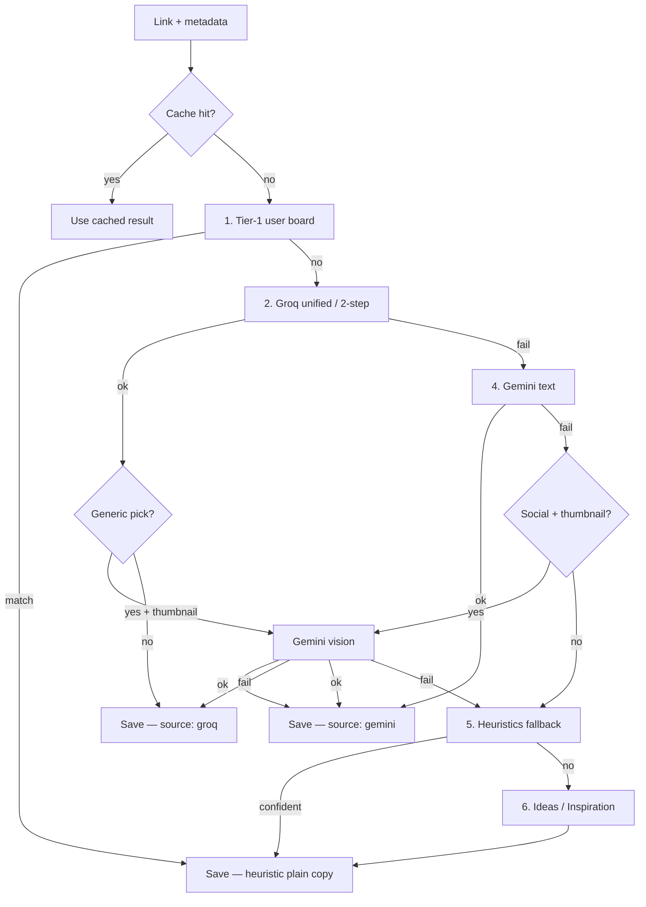

# Link classification

How Bookmark decides **board**, **title**, and **description** when you share a link.

Implementation: `supabase/functions/save-bookmark/index.ts`  
Structure reference: [SAVE_BOOKMARK_FUNCTION.md](./SAVE_BOOKMARK_FUNCTION.md)

---

## End-to-end flow

```
Share URL from phone
    → save-bookmark edge function
        → normalize URL
        → fetch metadata (oEmbed, Microlink, OG tags, YouTube player)
        → lookup classification cache (60-day TTL)
        → if miss: run classification pipeline (see below)
        → preview or save bookmark + create board if needed
```

Each user has **private** boards. The classifier reads the global **`board_catalog`** (~308 categories, EN + ES) plus that user's existing board names.

---

## Pipeline overview

| Step | Provider | Cost | When |
|------|----------|------|------|
| **0. Cache** | Postgres | Free | Same URL classified in last 60 days |
| **1. Tier-1 user boards** | Rules | Free | Title/topic genuinely matches a board the user already has |
| **2. Groq** | Llama via Groq | Groq quota | **Always first AI step** — board + title + description |
| **3. Gemini vision upgrade** | Google | Gemini quota | Groq/Gemini text returned a generic pick (Social Media, Social Network, …) + thumbnail |
| **4. Gemini text** | Google | Gemini quota | Groq failed; vision if text also fails on sparse social |
| **5. Heuristics** | Rules | Free | AI unavailable or exhausted |
| **6. Catch-all** | Rules | Free | Ideas / Inspiration |



**Design principle:** Groq is always the first AI step. Gemini vision runs only when text AI returns a generic pick. Heuristics are the last resort before Ideas.

1. Tier-1 user boards (deterministic)
2. Groq unified (board + title + description)
3. Gemini vision upgrade (if Groq/Gemini text result is generic + thumbnail)
4. Gemini text (if Groq failed) → same vision upgrade rule
5. Heuristics (AI down / quota exhausted)
6. Ideas / Inspiration (absolute last resort)

---

## Step 1 — Tier-1 user boards

**Goal:** Respect boards the user already created when the match is genuine.

| Signal | Example |
|--------|---------|
| Board name in title (non-incidental) | User has **Recipes** + title contains `receta` |
| Topic keyword → user's board | User has **CrossFit** + title mentions `crossfit` |

**Not tier-1:**

- Song title contains a board name (`My Medicine` ≠ Health/Medicine board) — `isIncidentalUserBoardMatch`
- Catalog-only matches (Rock, Music without user board) — deferred to Groq
- Ambiguous English (`House of the Dragon`, `series of tools`) — deferred to AI

**Copy:** plain metadata title for both title and description (no `Video:`, `Music:` prefixes).

Log: `Classified tier-1 (user board)`

---

## Step 2 — Groq (always first AI)

Requires **`GROQ_API_KEY`**. See [GROQ_SETUP.md](./GROQ_SETUP.md).

Runs for **every** link (Instagram, YouTube, Amazon, …) after tier-1 user boards.

If Groq returns a **generic** classification — board `Social Media`, title `Social Network`, boilerplate description, Ideas catch-all, etc. — and a thumbnail exists, **`maybeUpgradeWithVision`** runs Gemini vision on the image before saving.

Log upgrade: `Text AI result too generic — trying Gemini vision`

---

## Step 3 — Groq details (models & sub-flow)

Requires Supabase secret **`GROQ_API_KEY`**. See [GROQ_SETUP.md](./GROQ_SETUP.md).

### Models

| Secret | Default model | Role |
|--------|---------------|------|
| `GROQ_MODEL` | `llama-3.3-70b-versatile` | **Unified 1-call** — board + title + description |
| `GROQ_FALLBACK_MODEL` | `llama-3.1-8b-instant` | **2-step fallback** only |

### Groq sub-flow

```
A. 70B unified (1 API call)
   "Pick board + write title + description"
   ✅ → done

B. 8B two-step (only if A fails)
   B1. 8B board pick
   B2. 8B title + description
   ✅ → done

C. → Gemini (step 4)
```

**Why dual models:** 70B is stronger and usually needs **one call** (12K TPM). 8B is cheaper on daily quota (14.4K RPD) and used only as fallback.

### Rate limits (free tier, approximate)

| Model | RPM | RPD | TPM |
|-------|-----|-----|-----|
| 70B versatile | 30 | 1,000 | 12,000 |
| 8B instant | 30 | 14,400 | 6,000 |

See [Groq rate limits](https://console.groq.com/docs/rate-limits).

### AI output rules

- **Title:** max **40 characters** — `{Topic}: {Subject}` derived **only** from page metadata; no few-shot examples in prompts (models copy them)
- **Description:** 1–2 sentences about content; max 500 chars
- **Never:** platform boilerplate (*"Enjoy the videos…"*), likes/views/followers
- **Board order in prompt:** user boards → catalog → never Ideas when a catalog board fits

### Post-AI reconciliation

- Catch-all AI picks (Ideas) upgraded via `upgradeCatchallBoard` + `resolveBoardTiered`
- Board must align with title/description (`reconcileBoardWithClassification`)
- Tiered override when AI picks Ideas but metadata signals Rock, Music, etc.

### Log messages

| Log | Meaning |
|-----|---------|
| `Groq unified: success (1-call)` | 70B returned everything — best path |
| `Groq unified: missing title or description — using 8B 2-step path` | 70B incomplete → fallback |
| `Groq step 1/2 (8B fallback): board picked` | 8B board step |
| `Classified with Groq (2-step)` | Final result from 8B path |
| `Groq could not classify — trying Gemini` | All Groq calls failed |

---

## Step 4 — Gemini (text fallback + vision)

Requires **`GEMINI_API_KEY`**. See [GEMINI_SETUP.md](./GEMINI_SETUP.md).

Optional: `GEMINI_MODEL` (default `gemini-2.5-flash-lite`).

### Text path

Same board/title/description rules as Groq. Used when Groq fails.

Flow mirrors Groq: unified 1-call when possible, else board pick + copy generation.

### Vision upgrade (`maybeUpgradeWithVision`)

**When:** Groq or Gemini **text** succeeded but result is generic:

- Board: Social Media, Social Network, Content, Posts, Ideas, …
- Title: `Social Network`, `Social Media`, platform name, …
- Description: platform boilerplate or “social networking platform…”

**Requires:** thumbnail on the link.

**Always upgrades** when caption metadata is untrustworthy (Instagram login text, `@handle` only, title `Instagram`, etc.) — text models hallucinate boards/titles (e.g. random Hip-Hop freestyle).

**Also upgrades** when Groq returns an explicitly generic pick (Social Media, Social Network, Ideas, …) even if caption looked OK.

**Not triggered:** YouTube (or any URL) with a real oEmbed title/caption and a specific Groq pick.

If Groq **fails entirely**, Gemini text runs; same upgrade rule applies. If both text paths fail on sparse social (no trustworthy caption), Gemini vision runs as fallback.

Log: `Gemini could not classify — trying heuristics`

---

## Step 5 — Heuristics (fallback)

**Goal:** Classify without AI when providers are down, rate-limited, or returned nothing usable.

Runs **after** Groq and Gemini — not before.

### Two-layer rules (all domains)

1. **Umbrella nouns** — category words: `food`, `cocina`, `fitness`, `code`, `travel`…
2. **Domain methods** — generic actions: `bake`, `asar`, `train`, `debug`, `review`…

### Never used for heuristics

- Specific dish / entity names (`paella`, `pimientos`)
- Scene props (`lumbre`, venue names)
- Media format alone (`video`, `reel`, `shorts`)
- YouTube boilerplate descriptions (*"Enjoy the videos and music you love…"*)

### Special cases

| Signal | Board |
|--------|-------|
| YouTube `Artist - Track` title | Music genre from catalog (Rock, Pop, …) |
| Football scoreline in title (`2–1`) | Football |
| Unambiguous genre in title (`techno`, `k-pop`, `drill`) | Matching genre board |

### Ambiguous English

| Rule | Behavior |
|------|----------|
| **"X of Y" titles** | `series of tools`, `House of the Dragon` → skip topic heuristics |
| **Single-word user boards** | Never auto-match from title (`House`, `Series`, `Home`…) |
| **Incidental board names** | Song/brand names in title ≠ board topic (`My Medicine` ≠ Medicine) |

### Heuristic copy (plain)

Heuristic paths use **no prefixes** — title and description are the cleaned page title:

```
The Pretty Reckless - My Medicine
```

Not `Video: …` or `Music: …`. AI paths still use styled short titles.

Log: `Classified with heuristics (fallback)`

---

## Step 6 — Catch-all (Ideas / Inspiration)

When AI and heuristics both fail:

- Pick first available: **Ideas** → **Inspiration** → **Inspiración**
- Plain copy from metadata (same as other heuristic paths)
- User can move or edit later

Log: `Classified catch-all (AI + heuristics exhausted)`

---

## Board resolution helpers

| Function | Role |
|----------|------|
| `resolveBoardTiered` | User boards → catalog (used in AI post-processing, not as primary pipeline step) |
| `pickExistingOrCatalog` | Map catalog name to user board or catalog entry; Music → Rock/Pop/… fallback |
| `upgradeCatchallBoard` | Replace Ideas/Inspiration when metadata has stronger signal |
| `reconcileBoardWithClassification` | Align board with AI title/description keywords |

### Broad vs rejectable boards

| Type | Examples | Treatment |
|------|----------|-----------|
| **User boards** | Your Calisthenics, Fitness, Techno | **Highest priority** in AI prompts + tier-1 |
| **Broad catalog** | Fitness, Food, Travel | Valid final picks — refined when title suggests narrower topic |
| **Rejectable** | Video, Posts, Content, Entertainment | Never saved — refine or fallback |
| **Catch-all** | Ideas, Inspiration | Last resort only |

---

## Classification cache

| Setting | Value |
|---------|--------|
| Table | `link_classification_cache` |
| TTL | 60 days |
| Key | Normalized URL hash |
| Version | `CACHE_VERSION` in `index.ts` (currently **36**) |

Cached fields: `board_name`, `title`, `description`, `source` (`groq` | `gemini` | `heuristic`).

**Bump `CACHE_VERSION`** when classification logic changes materially — old entries are ignored.

**Not cached:** weak boards (Ideas without strong signal), platform boards, Shopping without commerce URL, empty titles.

---

## Board catalog

- Table: `board_catalog` — global, not per-user
- ~308 active categories in English and Spanish
- Includes genre boards (Rock, Pop, Hip-Hop, …) and umbrella **Music**
- AI prompts include grouped catalog + user's custom board names
- Edge function caches catalog **5 minutes** — DB-only catalog updates need no redeploy
- Add categories via idempotent SQL migrations

---

## Supabase secrets

```bash
supabase secrets set GROQ_API_KEY=gsk_...
supabase secrets set GROQ_MODEL=llama-3.3-70b-versatile
supabase secrets set GROQ_FALLBACK_MODEL=llama-3.1-8b-instant
supabase secrets set GEMINI_API_KEY=AIza...
# optional:
supabase secrets set GEMINI_MODEL=gemini-2.5-flash-lite
supabase secrets set SKIP_GROQ=true      # debug: skip Groq
supabase secrets set SKIP_GEMINI=true    # debug: skip Gemini
```

| Secret | Required | Purpose |
|--------|----------|---------|
| `GROQ_API_KEY` | For AI path | Groq API authentication |
| `GEMINI_API_KEY` | For vision/fallback | Google AI authentication |
| `SKIP_GROQ` / `SKIP_GEMINI` | Optional | Force skip providers (falls through to heuristics) |

`SUPABASE_SERVICE_ROLE_KEY` is auto-injected — needed for classification cache writes.

**Without AI keys:** tier-1 user boards → heuristics → Ideas.

**Shopping / product URLs:** no URL fast-path — Groq/Gemini classify from page title and metadata (avoids false positives like `/product` in non-shop URLs).

Deploy after code changes:

```bash
supabase functions deploy save-bookmark --project-ref YOUR_PROJECT_REF
```

---

## Example paths

| Link | Typical result |
|------|----------------|
| User has Recipes + recipe URL | Tier-1 → Recipes |
| Amazon product URL | Groq → Shopping (from title/metadata) |
| YouTube rock video | Groq → Rock + AI short title |
| YouTube music, Groq 429 | Gemini → or heuristics → Rock/Music (plain copy) |
| Instagram post, login boilerplate | Embed caption fetch → tier-2 Tattoo (or Groq with real caption) |
| YouTube song with good title | Groq only (no vision upgrade) |
| Obscure link, all APIs 429 | Heuristics → or Ideas |
| Same URL within 60 days | Cache hit — no AI |

---

## Maintenance

| Change | Action |
|--------|--------|
| Classifier logic | Edit `save-bookmark/index.ts`, bump `CACHE_VERSION`, deploy function |
| New board categories | `supabase db push --linked` (migration on `board_catalog`) |
| Rotate API key | `supabase secrets set KEY=new-value` |
| Debug provider | `SKIP_GROQ` or `SKIP_GEMINI` |

**Logs:** Supabase Dashboard → Edge Functions → `save-bookmark` → Logs

---

## Related docs

- [SAVE_BOOKMARK_FUNCTION.md](./SAVE_BOOKMARK_FUNCTION.md) — `index.ts` structure and modules
- [GROQ_SETUP.md](./GROQ_SETUP.md) — Groq account + secrets
- [GEMINI_SETUP.md](./GEMINI_SETUP.md) — Gemini account + secrets
- [SUPABASE_SETUP.md](./SUPABASE_SETUP.md) — new project from scratch
